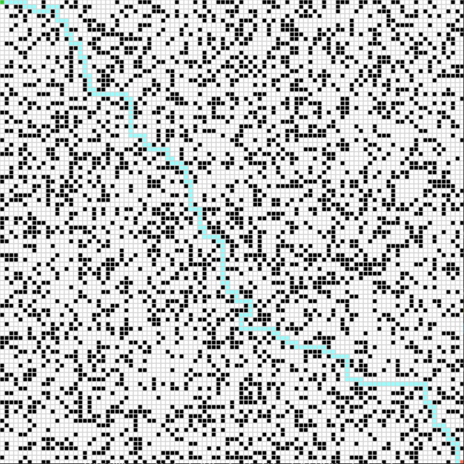
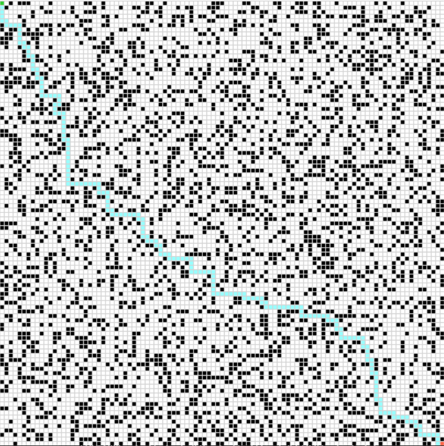
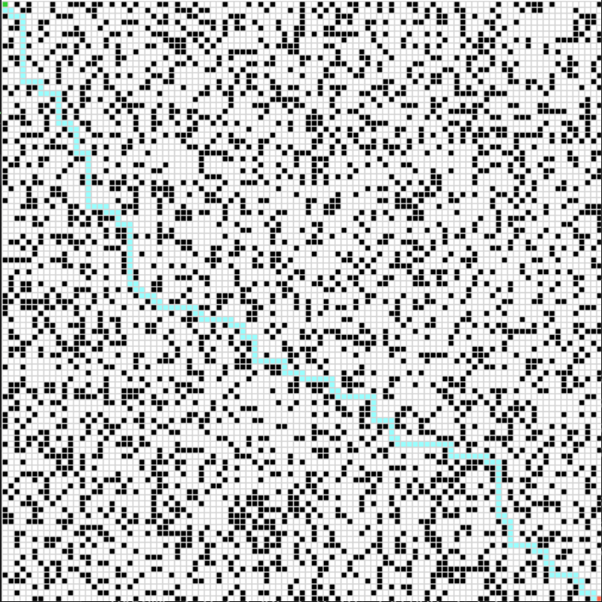
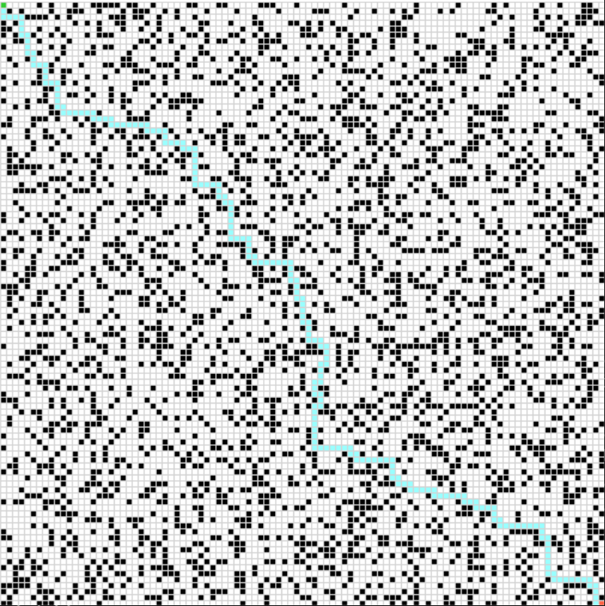
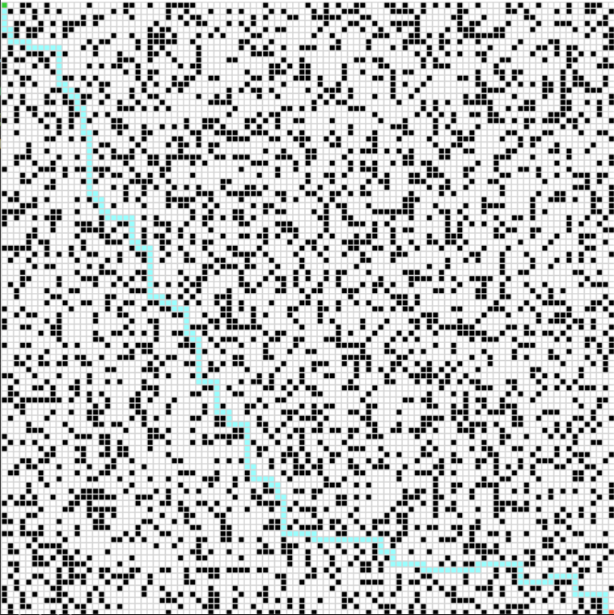

# How to Run Project
1, 2, 3, 4 correspond to 
adaptiveA, backwardA, forwardA largestG, forward smallestG searches

In the terminal, run
```
python maze.py [number] .\testcases\testcase[number]
```
For example, 
To run adaptiveA on testcase1:
```
python maze.py 1 .\testcases\testcase1
```
# Optimal Testcase Results
### Testcase1


### Testcase2


### Testcase3


### Testcase4


### Testcase5


# All Search Testcases vs. Optimal Testcases

# AdaptiveA vs. Optimal

# BackwardA vs. Optimal 

# ForwardA Largest G vs. Optimal

# ForwardA Smallest G vs. Optimal
